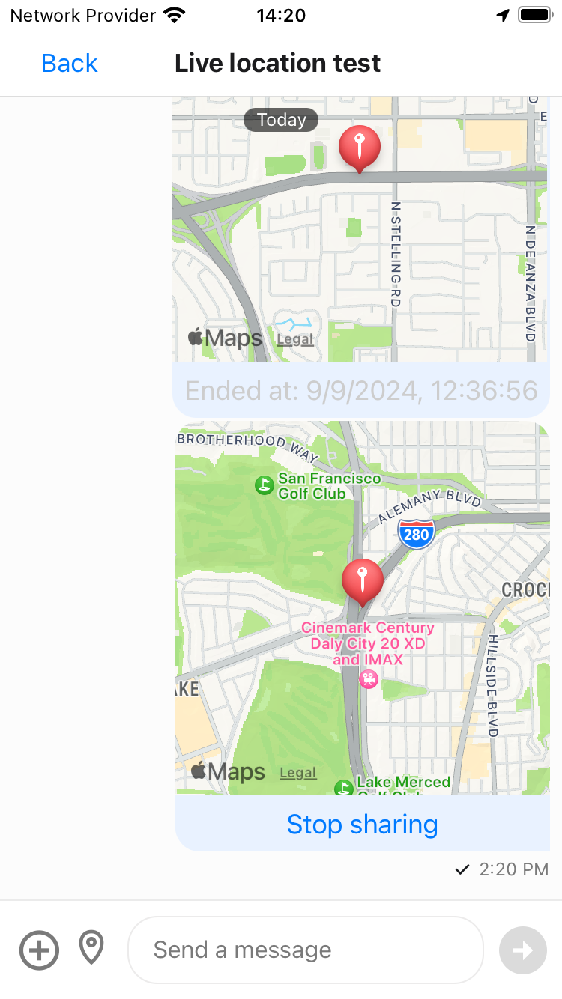
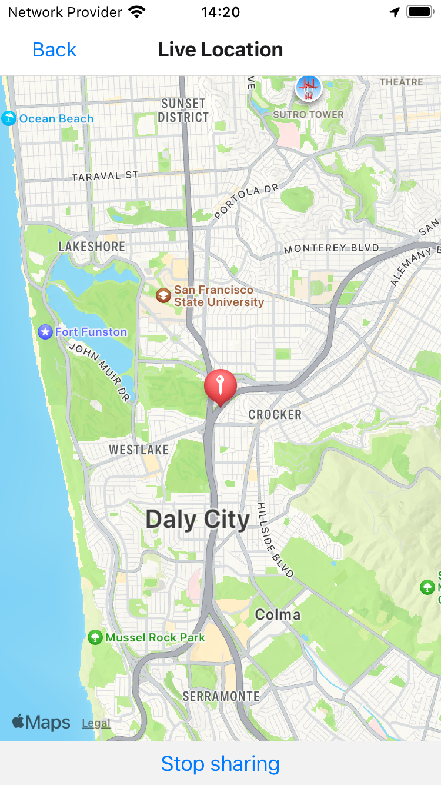

# Live Location Sharing Chat Sample Using Stream Chat React Native SDK

| Chat screen preview | Map detail screen preview |
|---|---|
|  | 

This sample app is implemented using Stream Chat React Native SDK. It is a fully fledged messaging app with the ability of sharing live location.

## Step 1: Setup

>**Note**: Make sure you have completed the [React Native - Environment Setup](https://reactnative.dev/docs/environment-setup) instructions till "Creating a new application" step, before proceeding.

**Install package dependencies:**

```bash
# Install dependencies
yarn
bundle install

# Install pod dependencies
bundle exec pod install --project-directory=ios
```

### Specify your Google Maps API key

The actual map implementation depends on the platform. On Android, one has to use [Google Maps](https://developers.google.com/maps/documentation/), which in turn requires you to obtain an [API key for the Android SDK](https://developers.google.com/maps/documentation/android-sdk/signup). On iOS, the native Apple Maps implementation is used and API keys are not necessary.

Add your API key to your manifest file (`android/app/src/main/AndroidManifest.xml`):

```xml
<application>
   <!-- You will only need to add this meta-data tag, but make sure it's a child of application -->
   <meta-data
     android:name="com.google.android.geo.API_KEY"
     android:value="Your Google maps API Key Here"/>
</application>
```

## Step 1: Start the Metro Server

First, you will need to start **Metro**, the JavaScript _bundler_ that ships _with_ React Native.

To start Metro, run the following command from the _root_ of your React Native project:

```bash
yarn start
```

## Step 2: Start the Application

Run the following command to start your _Android_ or _iOS_ app:

### For Android

```bash
yarn android
```

### For iOS

```bash
yarn ios
```
